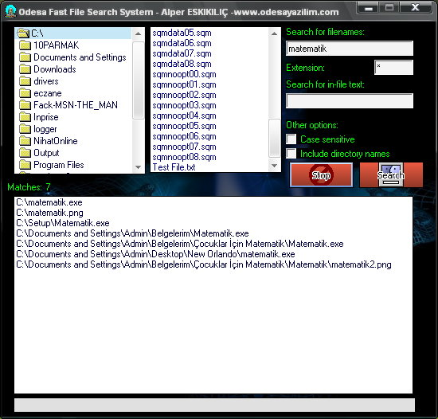

<div align="center">

## Odesa Very Very Fast File Search


</div>

### Description

This code is very very very fast file search system.You can make search only in seconds.It likes win98 search system but it works in Winxp and all windows versions.

You can find your files only 8 seconds!Yes only 8 seconds.You can search a lot of thing.

This code have list controls.When it finds something, it list all of them.
 
### More Info
 
Private Declare Function PathFileExists Lib "shlwapi.dll" Alias "PathFileExistsA" (ByVal pszPath As String) As Long

Dim Alper As Boolean

Using apis


<span>             |<span>
---                |---
**Submitted On**   |2008-07-17 14:54:12
**By**             |[Alper ESKIKILI�](https://github.com/Planet-Source-Code/PSCIndex/blob/master/ByAuthor/alper-eskikili.md)
**Level**          |Advanced
**User Rating**    |4.3 (17 globes from 4 users)
**Compatibility**  |VB 5\.0, VB 6\.0
**Category**       |[Complete Applications](https://github.com/Planet-Source-Code/PSCIndex/blob/master/ByCategory/complete-applications__1-27.md)
**World**          |[Visual Basic](https://github.com/Planet-Source-Code/PSCIndex/blob/master/ByWorld/visual-basic.md)
**Archive File**   |[Odesa\_Very2120947182008\.zip](https://github.com/Planet-Source-Code/alper-eskikili-odesa-very-very-fast-file-search__1-70847/archive/master.zip)

### API Declarations

```
Private Declare Function PathFileExists Lib "shlwapi.dll" Alias "PathFileExistsA" (ByVal pszPath As String) As Long
```


